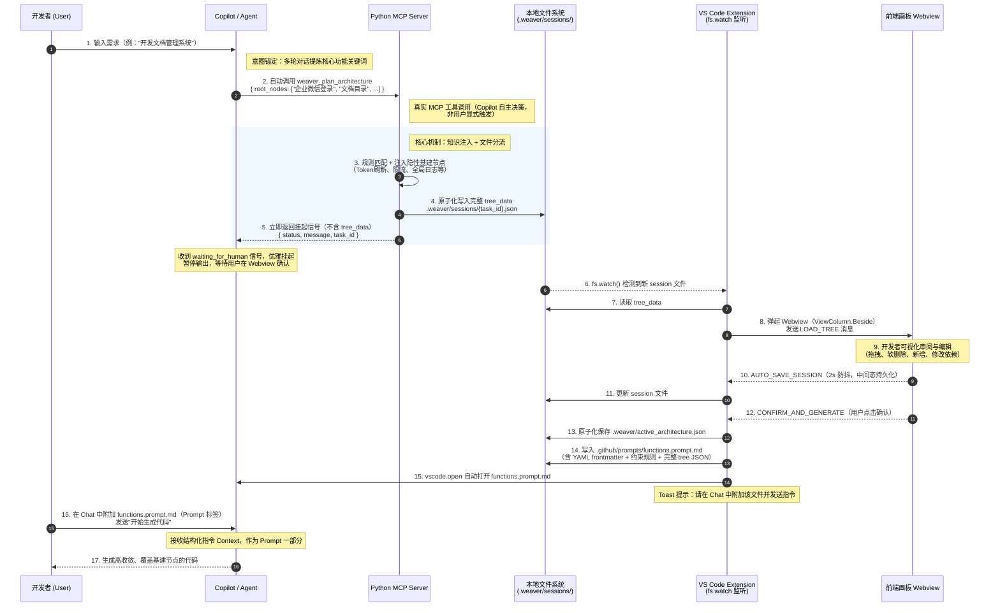

# 系统时序图 — Option A：真实 MCP + 文件系统监听架构

> **架构决策（已确认）**：采用 Option A。Python MCP Server 作为真正的 MCP 工具发布（`pip install`），VS Code Extension 作为独立的可视化层（Marketplace 发布）。两者通过本地文件系统（`.weaver/sessions/`）解耦通信，Extension 使用 `fs.watch()` 监听新 session 文件。Copilot 直接与真实 MCP 协议通信，可自动调用工具（无需用户显式选择 `#weaverPlan`）。

---

## 主流程时序图



---

## 组件职责边界（Option A）

```
用户安装两个独立组件：

  pip install function-weaver-mcp
  ↳ 真实 MCP Server，发布到 PyPI
  ↳ 用户在 .vscode/mcp.json 中注册（支持 uvx 一键启动）
  ↳ Copilot 自动发现，按上下文决策是否调用
  ↳ 职责：规则匹配 → 注入基建节点 → 写磁盘 → 返回挂起信号

  VS Code Marketplace: Function Weaver Extension
  ↳ 用 vscode.workspace.createFileSystemWatcher 监听 .weaver/sessions/
  ↳ 检测到新文件 → 读取 tree_data → 弹起 Webview
  ↳ 处理用户确认 → 写入 functions.prompt.md
  ↳ 职责：可视化层，不参与 MCP 通信链路

通信媒介：.weaver/sessions/{task_id}.json（本地文件系统）
  MCP Server ──写入──→ session 文件 ←──读取── Extension
  两者完全解耦，无直接进程间通信（无 IPC，无 stdio 拦截）
```

---

## 关键设计对比（旧方案 vs Option A）

| 维度 | 旧方案（registerTool 拦截） | Option A（真实 MCP + 文件监听） |
|------|--------------------------|-------------------------------|
| 工具调用方式 | 用户显式选择 `#weaverPlan` | Copilot 自主调用（真实 MCP 协议） |
| tree_data 分流 | Extension 在通信链路中拦截 stdio | MCP Server 自身写文件，Extension 旁观文件系统 |
| 组件耦合度 | Extension 必须作为中间人进程 | 完全解耦，各自独立发布和维护 |
| 产品形态 | Extension 捆绑 MCP | MCP 独立发布（pip），Extension 是可选增强 |
| Copilot 触发时机 | 仅用户显式触发 | Copilot 基于上下文自主决策 |